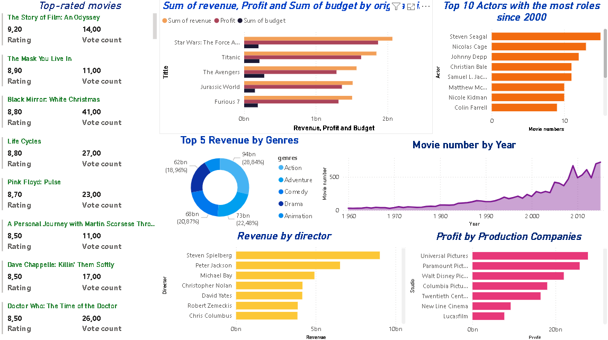
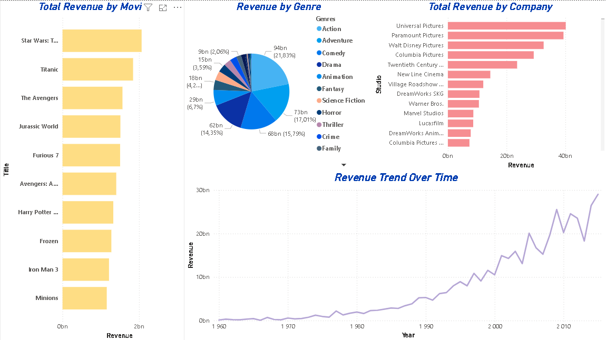
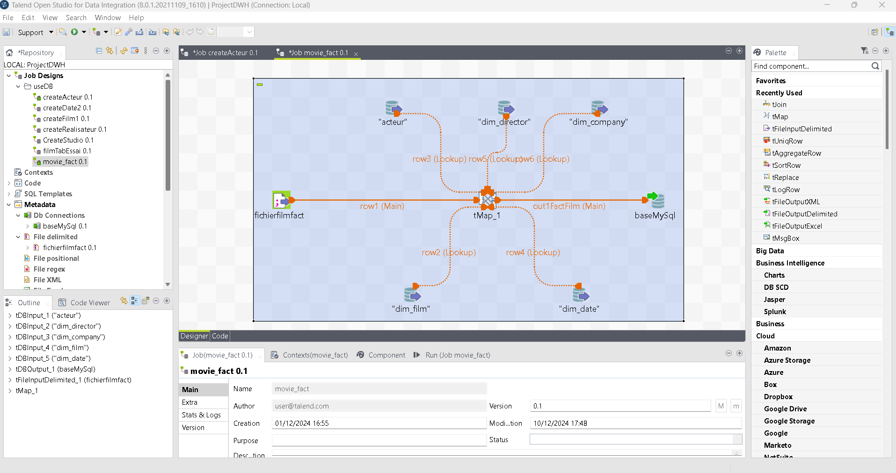
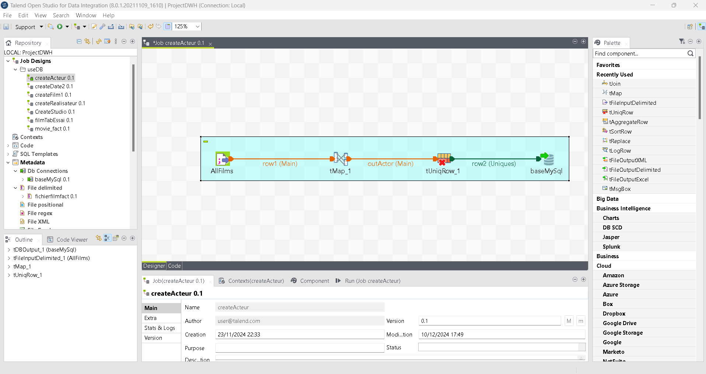

# **ELT Movies Data Warehouse & Analysis Project** 🎬📊

## **Project Overview**

Welcome to the **ELT Movies Data Warehouse & Analysis** project! This initiative demonstrates the complete ETL (Extract, Transform, Load) process applied to a large dataset of movie information. Using **Talend** for ETL, we transform raw movie data from IMDb into a structured database, enabling efficient analysis and insightful visualizations. The database is then linked to **Power BI** to create interactive dashboards, presenting data insights about movie trends, performance, and key metrics.

This project focuses on 10,850 movies, providing a comprehensive overview of the movie industry across various dimensions like genres, cast, directors, ratings, and more.

### **Key Features** 
✨ **ETL Process**:
- **Extract**: Movie data from Kaggle website.
- **Transform**: Cleanse and aggregate the data using **Talend** to fit the database schema.
- **Load**: Store the cleaned and structured data in a relational database for efficient querying.

📦 **Data Warehouse Design**:
- **Star Schema**: Includes dimension tables for categories like movies, genres, and production companies, with a central fact table for movie statistics (ratings, revenue, etc.).

📊 **Power BI Dashboards**:
- Visualizations of movie trends, ratings, and revenue.
- Interactive analysis of movie genres, top directors, and studios.

---

## **Technologies Used** 🚀

This project utilizes the following technologies:

- **ETL Tool**: [Talend Open Studio](https://www.talend.com) – A powerful platform for extracting, transforming, and loading data.
- **Database**: MySQL or PostgreSQL – Used to store the structured data from the ETL process.
- **Visualization Tool**: [Power BI](https://powerbi.microsoft.com/en-us/) – For creating interactive and dynamic dashboards.
- **Data Sources**: IMDb Datasets.

---

## **Getting Started** ⚙️

### **Prerequisites** 🔧
To set up this project locally, you’ll need the following:

1. **Talend Open Studio**: Download and install [Talend](https://www.talend.com).
2. **Database**: Install MySQL or PostgreSQL and create a database for the transformed data.
3. **Power BI Desktop**: Install the [Power BI Desktop](https://powerbi.microsoft.com/en-us/desktop/) for visualization.

---

### **Steps to Run** 📋

1. **Set up the ETL Process**:
   - Import the Talend jobs from the `/TalendProject/PROJECTDWH` folder.
   - Execute the jobs to extract, transform, and load the IMDb data into the database.
   
2. **Connect Power BI**:
   - Open the `MoviesReport.pbix` file in Power BI Desktop.
   - Link Power BI to the database, refresh the data, and start exploring the interactive dashboards.

---

## **Visualizations** 🎨

The Power BI dashboards bring the movie data to life, providing in-depth insights into movie performance:

- **Dashboard Overview**: Displays key metrics such as total movie count, average ratings, and revenue trends.
- **Genre Analysis**: A deep dive into the popularity of different movie genres over time.
- **Director & Production Company Performance**: Insights into the top-performing directors and studios based on movie revenue.

---

## **Dataset Information** 📝

The dataset used in this project consists of **10,850 movies** with detailed information from IMDb

---

## **Contributing** 🤝

Contributions are welcome! If you’d like to contribute to the project, feel free to fork the repository, submit a pull request, or open an issue for any suggestions or bug fixes.

---

## **Screenshots** 📸

Here are some sample screenshots of the Power BI visualizations:

- **Power BI Dashboard Overview**  
  
  
- **Revenue Analysis Visualization**  
  

- **Talned Jobs**  
  
  

---
